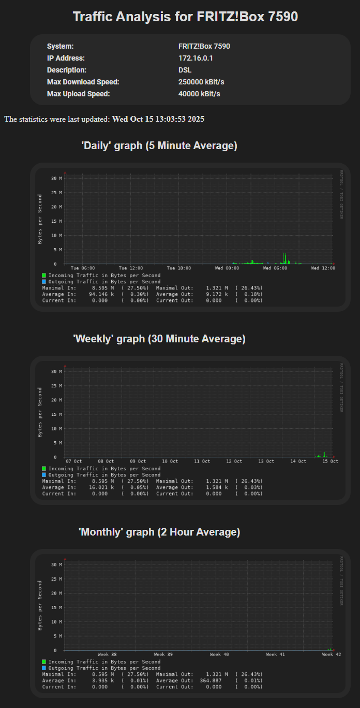

# Monitor your FRITZ!Box

      

Simple, lightweight script that uses `upnp2mrtg` to communicate with your
Fritz!Box and collect bandwidth data. It's then sent to `mrtg` for pretty
graphs and finally displayed to a simple website using `nginx`.

The whole project is based on the work of [Thorsten Kukuk](https://github.com/thkukuk/fritzbox-monitoring/)

## Running the Container

Docker compose (recommended):
```
services:
  fritzbox-mrtg:
    image: shark5060/fritzbox-mrtg:latest
    container_name: fritzbox-mrtg
    environment:
      - TZ=Europe/Berlin
      - DEBUG=0
      - RUN_WEBSERVER=1
      - USE_DARKMODE=1
      - POLL_INTERVAL=300
      - MAX_DOWNLOAD_BYTES=12500000
      - MAX_UPLOAD_BYTES=5000000
      - FRITZBOX_MODEL=7590
      - FRITZBOX_IP=192.168.1.1
    volumes:
      - /path/to/config:/srv/www/htdocs
    ports:
      - 3000:80
    restart: unless-stopped
```

Docker run:
```
docker run -d \
  --name=fritzbox-mrtg \
  -e TZ=Europe/Berlin \
  -e DEBUG=0 \
  -e RUN_WEBSERVER=1 \
  -e USE_DARKMODE=1 \
  -e POLL_INTERVAL=300 \
  -e MAX_DOWNLOAD_BYTES=12500000 \
  -e MAX_UPLOAD_BYTES=5000000 \
  -e FRITZBOX_MODEL=7590 \
  -e FRITZBOX_IP=192.168.1.1 \
  -p 3000:80 \
  -v /path/to/config:/srv/www/htdocs \
  --restart unless-stopped \
  shark5060/fritzbox-mrtg:latest
```

## Environment Variables

All binary variables use either `1` or `0` as value.

| Variable | Description | Default |
| ------------- | ------------- | ------------- |
| DEBUG  | Run entrypoint script in debug mode. | `0` |
| TZ  | Set a timezone the container should use. <br>Use [this Wikipedia List](https://en.wikipedia.org/wiki/List_of_tz_database_time_zones) for Values. | `Europe/Berlin` |
| POLL_INTERVAL  | Polling interval in seconds. | `300` |
| RUN_WEBSERVER  | Run NGINX Webserver to display output. | `1` |
| USE_DARKMODE  | Set to `1` if you want to use the Darkmode CSS values. | `1` |
| MAX_DOWNLOAD_BYTES  | Max. incoming traffic in Bytes per Second. | `12500000` |
| MAX_UPLOAD_BYTES  | Max. outgoing traffic in Bytes per Second. | `5000000` |
| FRITZBOX_MODEL  | Model of the Fritz!Box being monitored. | `7590` |
| FRITZBOX_IP  | IP address of the Fritz!Box being monitored. <br>Container needs to be able to reach this IP. | `192.168.1.1` |

## Volumes:

`/path/to/config:/srv/www/htdocs`
Output directory for both the historical data (stored in `fritzbox.log`) as well as the generated images/website.
Point this to a directory writeable by the docker user or the user set in the compose/run command.
If unset, data will not be persistent.

## Output

to view the generated website, visit `http://your.dockerhost.ip:3000/fritzbox.html`.

## Make it pretty

You can edit the default `style.css` located in the directory configured above to control how the website looks.

## Screenshot



## Notice

The logfile will look like this the first time the container is run (or if the files fritzbox.log and fritzbox.old are deleted):
```
Rateup WARNING: /usr/bin/rateup could not read the primary log file for fritzbox
Rateup WARNING: /usr/bin/rateup The backup log file for fritzbox was invalid as well
Rateup WARNING: /usr/bin/rateup Can't rename fritzbox.log to fritzbox.old updating log file
```
This is normal and expected behavior due to how `rateup` handles the file opening. More information in the [MRTG GitHub](https://github.com/oetiker/mrtg/blob/master/src/src/rateup.c#L1328)